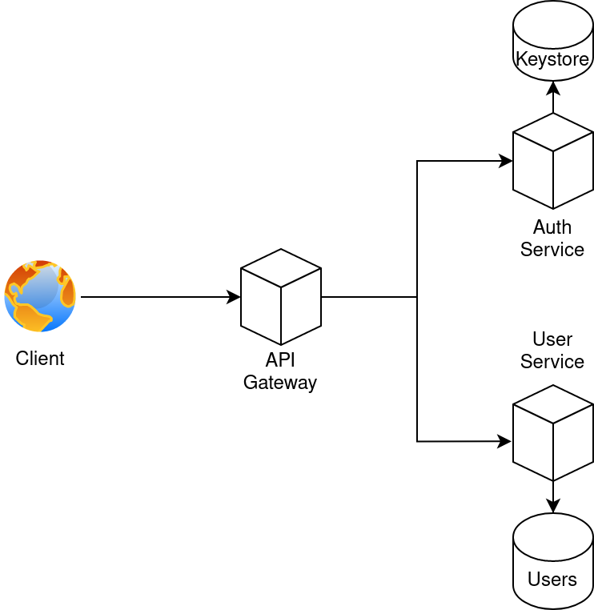
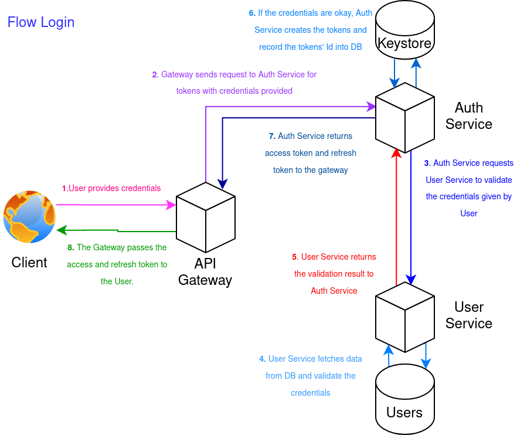
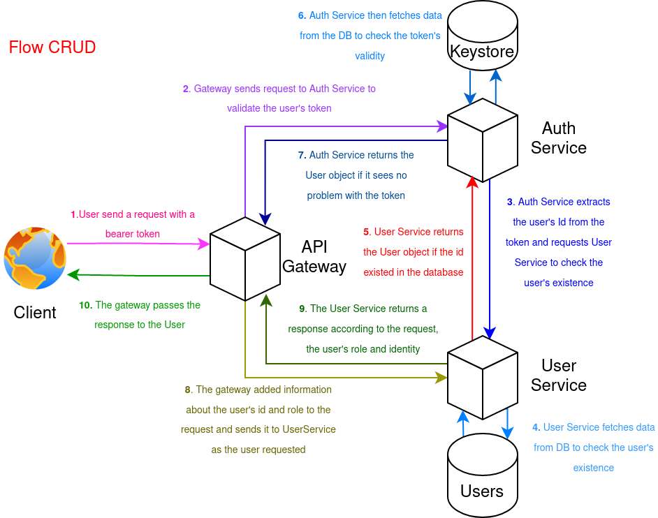
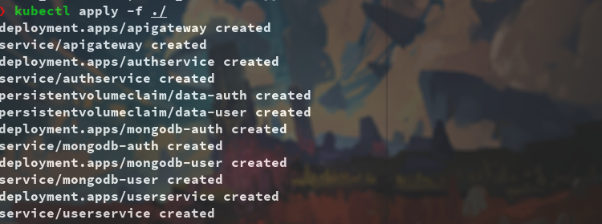
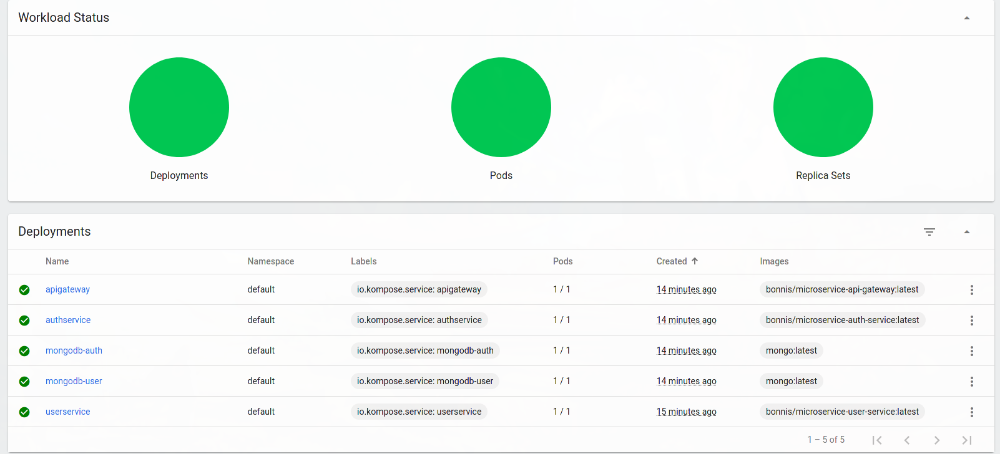
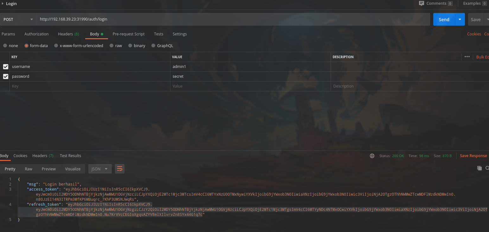

# Simple user CRUD using Microservices architecture

## Seeded Initial Users
Use these credentials to login at "/auth/login"
- Admin  
  username : admin1  
  password : secret  

- User  
  username : user1  
  password : secret

## API Documentation
Swagger documentation available at "/api-docs"

## Architecture

## Login Flow

## CRUD Flow

## Local deployment using minikube
 
Running kubectl  

  
Minikube dashboard

 
Test using postman 

